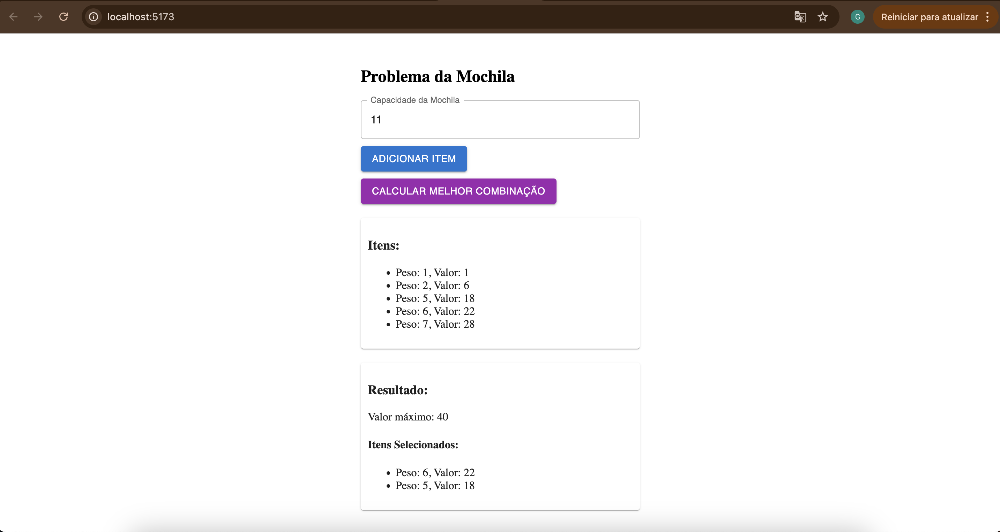
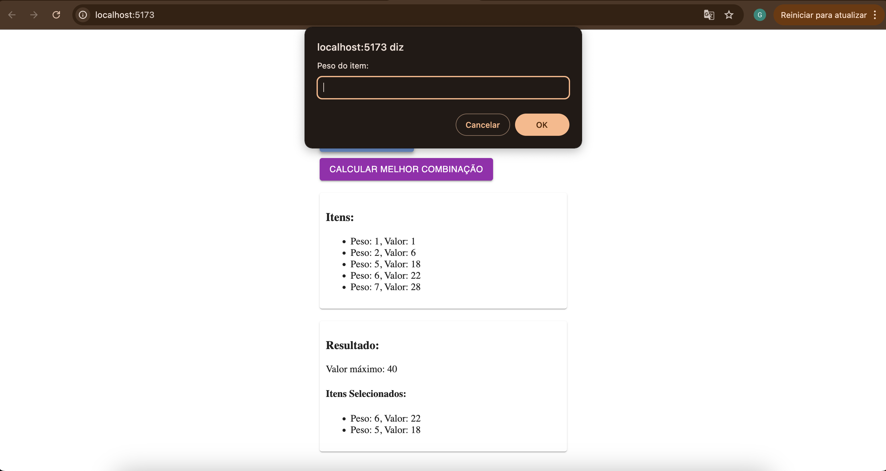
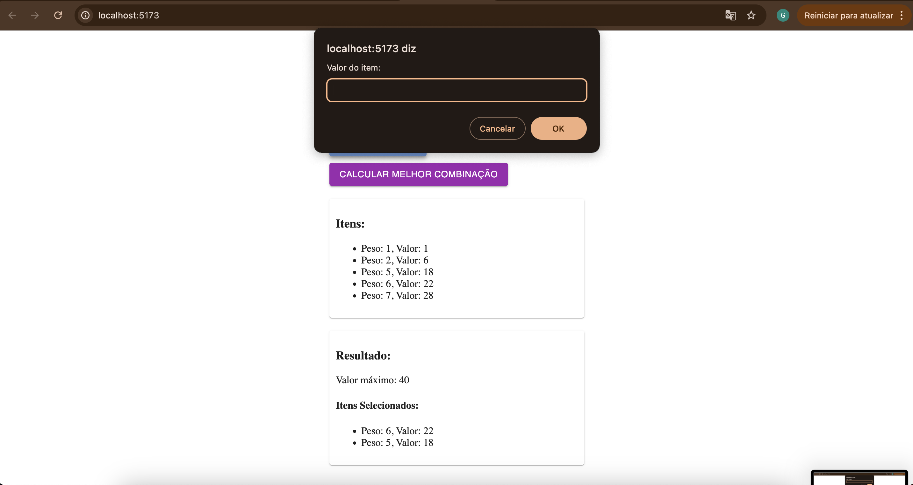

Temas:
 -  Programacao dinamica


### Link da apresentacao

[APRESENTAÇÃO](https://youtu.be/NXxIAsg79Ao)

##teste

# NomedoProjeto
## knapsack-algorithm

**Conteúdo da Disciplina**: Programação dinamica<br>

## Alunos
|Matrícula | Aluno |
| -- | -- |
| 19/0087439  |  Gabriel de Souza Fonseca Ribeiro |
| 19/0091606 |  Lucas Caldas Barbosa de Sousa |

## Sobre 
Esse projeto visa aplicar os conceitos de programação dinamica ministrados em sala de aula, foi utilizado um algoritmo para resolver o "problema da mochila".É um conceito que envolve a seleção de itens para preencher uma mochila com capacidade limitada. O objetivo é maximizar o valor total dos itens escolhidos.
## Screenshots




## Instalação 
**Linguagem**: Node Js com Typescript<br>
**Framework**: React<br>


## Uso 
Para poder rodar o projeto é necessário seguir os seguintes passos:

### Instalação do Node
### Clonar o repositório
- Acessar a pasta knapsack-app
```
cd knapsack-app

```
### Instalar as dependências com o yarn install ou npm i
### Rodar o projeto com npm run dev 


